 

 

I'm an Information Technology and Digital Innovation Engineer and the CEO of **LESSSO**. I build websites designed with AI and powered by AI, monitor security environments with **Wazuh**, and run **authorized penetration tests** to find weaknesses before attackers do.

<h2> What I do</h2>

<table>
  <tr>
    <td valign="top" width="33%">
       
      <b>AI-powered web</b>  
      Websites designed and built with AI assistance, and sites that integrate AI features such as assistants and automation. I pick the model and tools that best fit each project.
    </td>
    <td valign="top" width="33%">
       
      <b>Security monitoring with Wazuh</b>  
      Monitoring tailored to each organization through custom detection rules, so the alerts you receive match your environment and your risks.
    </td>
    <td valign="top" width="33%">
       
      <b>Penetration testing</b>  
      Authorized security assessments that uncover real weaknesses, delivered with clear findings and practical remediation guidance.
    </td>
  </tr>
</table>

<h2> Tools &amp; platforms</h2>

  
  
  
  
  
  <!-- Add more badges the same way, e.g.:
  
  -->

<h2> How I work</h2>

<table>
  <tr>
    <td valign="top" width="25%"><b>01 · Discover</b>  Understand your business, your environment and what you need to protect or build.</td>
    <td valign="top" width="25%"><b>02 · Scope</b>  Agree on goals, boundaries and rules of engagement in writing before any work starts.</td>
    <td valign="top" width="25%"><b>03 · Execute</b>  Build, configure or test, keeping you informed along the way.</td>
    <td valign="top" width="25%"><b>04 · Deliver</b>  Clear documentation and reporting you can act on, plus guidance on next steps.</td>
  </tr>
</table>

<h2> Training &amp; certifications</h2>

<table>
  <tr>
    <td><b>Cisco Networking Academy</b> — CCNA (course badge)</td>
    <td align="right"></td>
  </tr>
  <tr>
    <td><b>Hack The Box</b> — Certified Penetration Testing Specialist (CPTS)</td>
    <td align="right"></td>
  </tr>
</table>

Areas covered by the CPTS path I'm studying

 

- Penetration testing process, reconnaissance and information gathering
- Network and service enumeration, footprinting and vulnerability assessment
- Web application attacks
- Password attacks and attacks against common services
- Shells, payloads and exploitation frameworks
- Privilege escalation on Linux and Windows
- Active Directory enumeration and attacks
- Pivoting, tunneling and lateral movement
- Documentation and professional reporting

<h2> Ethics &amp; scope</h2>

Security work is only carried out with **written authorization**, inside an agreed **scope and rules of engagement**. Client data and findings are treated as confidential and are never published in public repositories. Vulnerabilities are reported privately and responsibly.

<h2> Projects &amp; write-ups</h2>

I don't have public projects yet. This is where I'll publish what I can share: Wazuh rule sets, lab write-ups and open-source tools.

<!--
When you publish something, replace the paragraph above with a table like this:

| Project | Description | Stack |
| --- | --- | --- |
| [repo-name](https://github.com/JuanRomeroHDZ/MIXTLI) | One-line description | Wazuh |
-->

<h2> GitHub activity</h2>

<!-- Replace JuanRomeroHDZ below (3 places) with your GitHub username. -->

  <picture>
    <source media="(prefers-color-scheme: dark)" srcset="https://github-readme-stats.vercel.app/api?username=JuanRomeroHDZ&show_icons=true&hide_border=true&bg_color=00000000&title_color=2BA687&icon_color=2BA687&text_color=C9D1D9&ring_color=A63A55">
    
  </picture>
  <picture>
    <source media="(prefers-color-scheme: dark)" srcset="https://github-readme-stats.vercel.app/api/top-langs/?username=JuanRomeroHDZ&layout=compact&hide_border=true&bg_color=00000000&title_color=2BA687&text_color=C9D1D9">
    
  </picture>

<h2> Contact</h2>

Interested in a website, security monitoring or a penetration test for your organization? Get in touch.

 

  
    
  LESSSO · Web &amp; AI · Security Monitoring · Penetration Testing

